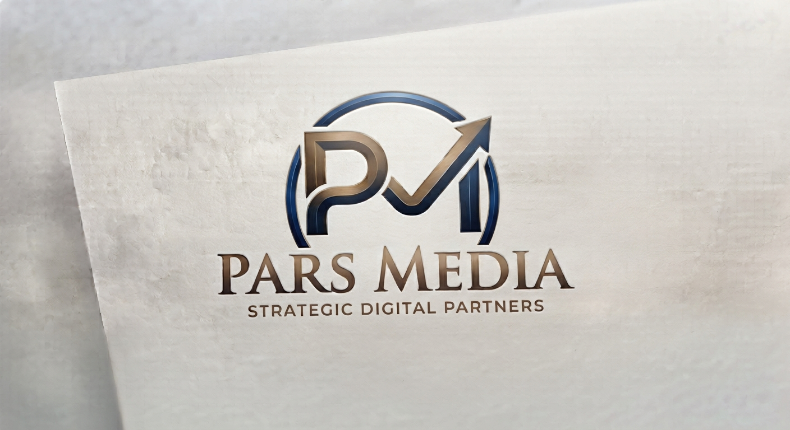

<!DOCTYPE html>
<html lang="fa" dir="rtl">
<head>
    <meta charset="UTF-8">
    <meta name="viewport" content="width=device-width, initial-scale=1.0">
    <title>درباره ما - پارس مدیا و پارس کالا</title>
    
</head>
<body>

    <header>
        <a href="index.html" class="logo-area">
            
            

                پارس کالا
                پارس مدیا (Strategic Digital Partners)
            

        </a>
        

            <a href="index.html">صفحه اصلی</a>
            <a href="about.html" style="font-weight: bold; color: #1a382b;">درباره ما</a>
        

    </header>

    

        

            <h1>درباره هلدینگ رسانه‌ای پارس مدیا</h1>
            
مجموعه‌ای پیشرو در زمینه تولید محتوا، رسانه، و تامین تجهیزات و کالاهای مدرن بدون مرز

        

        

            <h2>پارس مدیا؛ داستان و هویت ما</h2>
            
«پارس مدیا» یک مجموعه و شرکت رسانه‌ای پویا است که با هدف تولید محتوای تخصصی، ساخت ویدیوهای باکیفیت و پوشش حوزه‌های مختلف از جمله کسب‌وکار، تجارت و گردشگری بین‌المللی فعالیت می‌کند.

            
ما در پارس مدیا تلاش می‌کنیم با خلق ایده‌های نوآورانه، ارتباط بدون واسطه با مخاطبان و استانداردهای حرفه‌ای، جایگاه ویژه‌ای در دنیای دیجیتال و رسانه خلق کنیم.

        

        

            <h2>پارس کالا؛ پل ارتباطی کالاهای خاص</h2>
            
فروشگاه «پارس کالا» به عنوان بخش تجاری و تامین کالای مجموعه پارس مدیا متولد شده است. فلسفه اصلی ما ارائه لوازم جانبی کاربردی، گجت‌های هوشمند و انتخاب‌های روزمره با بالاترین کیفیت است تا دسترسی به کالاهای خاص برای مخاطبان به ساده‌ترین شکل ممکن فراهم شود.

            
            

                

                    <h3>کالاهای برگزیده</h3>
                    
گلچینی از کاربردی‌ترین محصولات، تجهیزات سفر و گجت‌های روز دنیا برای سلیقه‌های خاص.

                

                

                    <h3>رویکرد مدرن</h3>
                    
فراهم کردن دسترسی به انتخاب‌های ارزشمند بر اساس استانداردهای بین‌المللی و دیجیتال.

                

                

                    <h3>اصالت و پشتیبانی</h3>
                    
تضمین کیفیت و پشتیبانی مستقیم کالاها با نام و اعتبار هلدینگ رسانه‌ای پارس مدیا.

                

            

        

    

    <footer>
        تمامی حقوق محفوظ است © 2026 - هلدینگ رسانه‌ای پارس مدیا / پارس کالا
    </footer>

</body>
</html>
